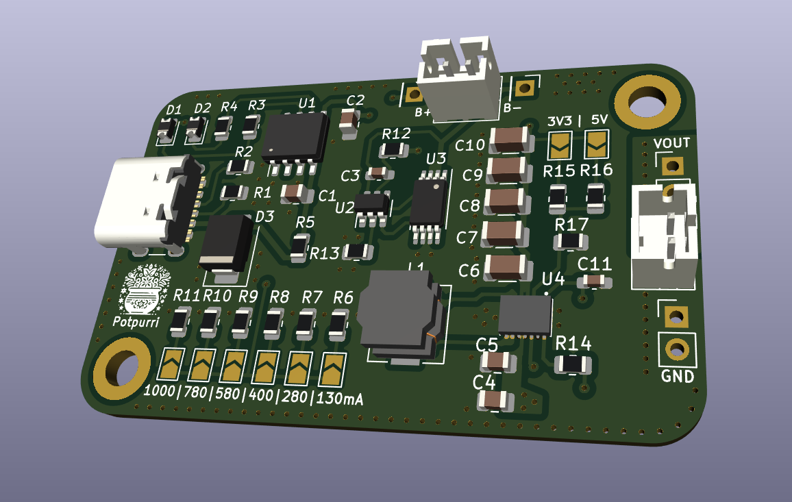
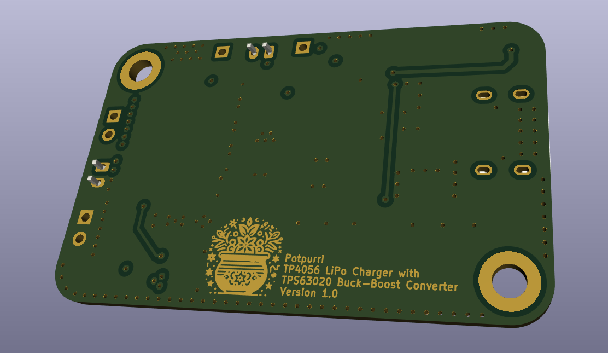
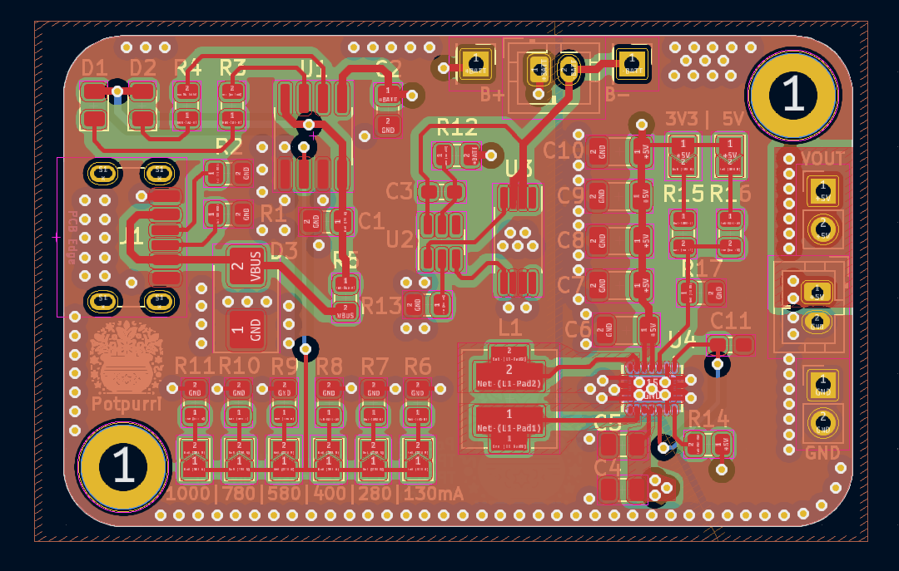

# Lithium Battery Charger and Boost Converter PCB

This PCB is designed to safely charge a lithium-ion cell and provide a selectable 3.3V or 5V output. It's equipped with components that ensure safe charging and protection for the battery and supports flexible output and charging options. 

## Features

- **Charging IC**: TP4056 with adjustable charge currents.
- **Protection Circuitry**: DW01A and F8205A provide overcharge, over-discharge, and overcurrent protection.
- **Buck-Boost Converter**: TPS63020 for stable 3.3V or 5V output, selectable via solder jumper.
- **Compact Design**: Ideal for portable applications, with both top and bottom images of the board for easy identification.

## Charging Current Settings

The charging current of the TP4056 can be adjusted using solder jumpers on the PCB to meet various requirements. Refer to the table below:

| Solder Jumper Setting | Charging Current |
|-----------------------|------------------|
| J6                    | 130 mA          |
| J5                    | 280 mA          |
| J4                    | 400 mA          |
| J3                    | 580 mA          |
| J2                    | 780 mA          |
| J1                    | 1000 mA         |

## Images

### Schematic

### 3D Renderings
- Front View: 
- Back View: 

### PCB
**4-Layer Stackup**: Signal Layer, GND Layer, Power Layer, Signal Layer
- All layers: 
- Front traces: 
- GND plane: 
- PWR plane: 
- Back traces: 

## Usage

1. **Output Voltage Selection**: Set the desired output voltage (3.3V or 5V) by configuring the solder jumper on the PCB.
2. **Charging Current Selection**: Set the charging current by adjusting the appropriate solder jumper(s) according to the table above.
3. **Connect Battery**: Connect the lithium-ion cell to the battery terminals.
4. **Power Input**: Provide power via the charging input, and the circuit will manage safe charging for the battery and maintain output stability.

---

This board is ideal for applications needing a stable 3.3V or 5V from a lithium-ion cell with enhanced safety and flexibility.
